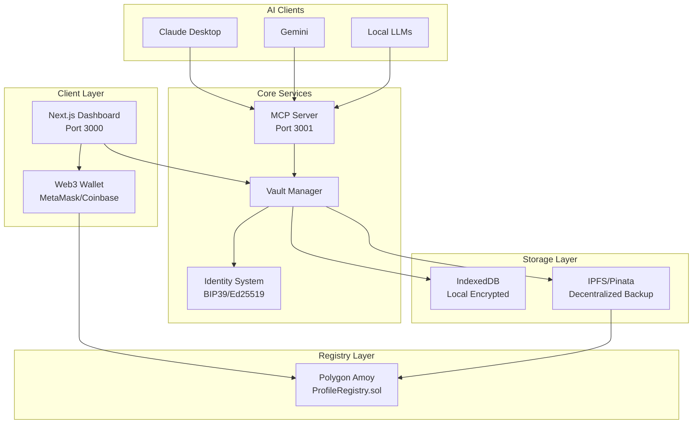
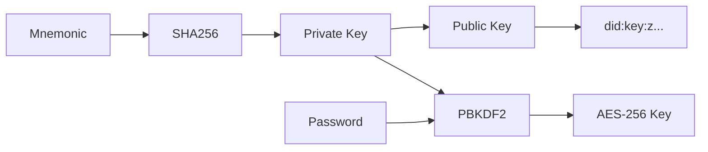
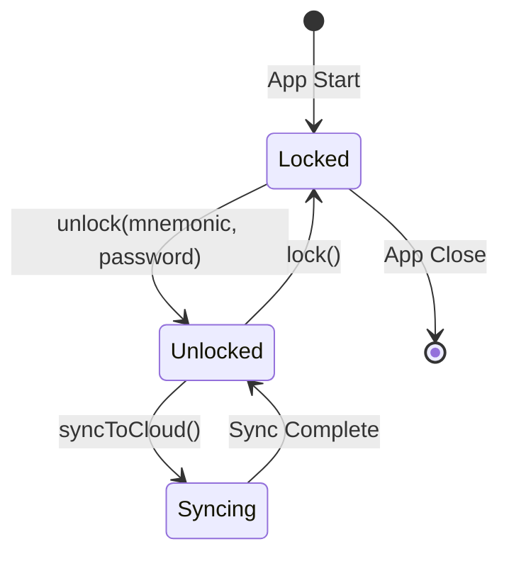
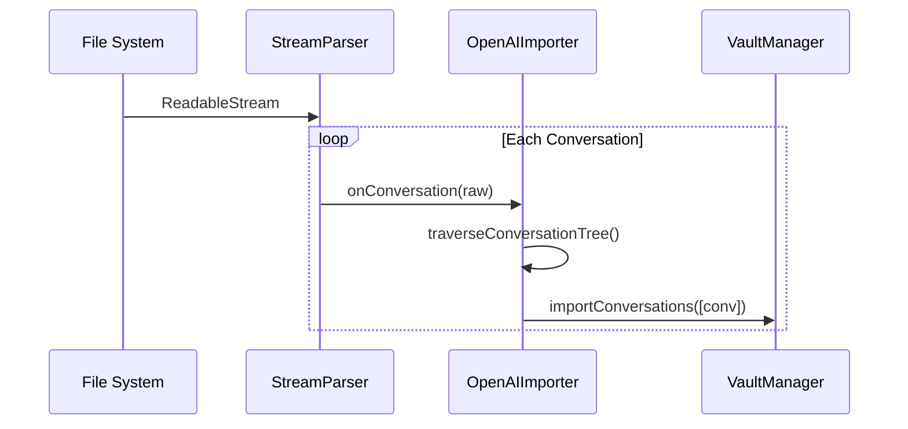
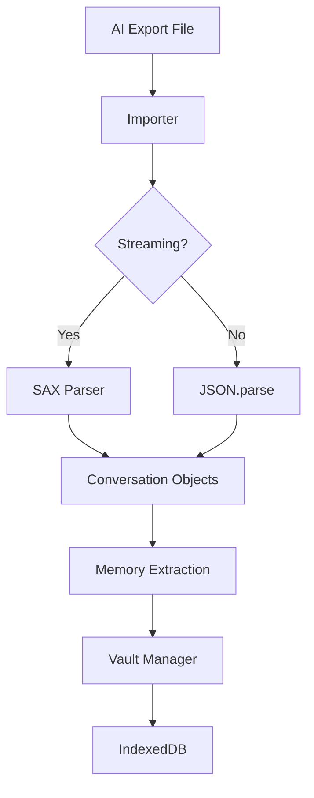
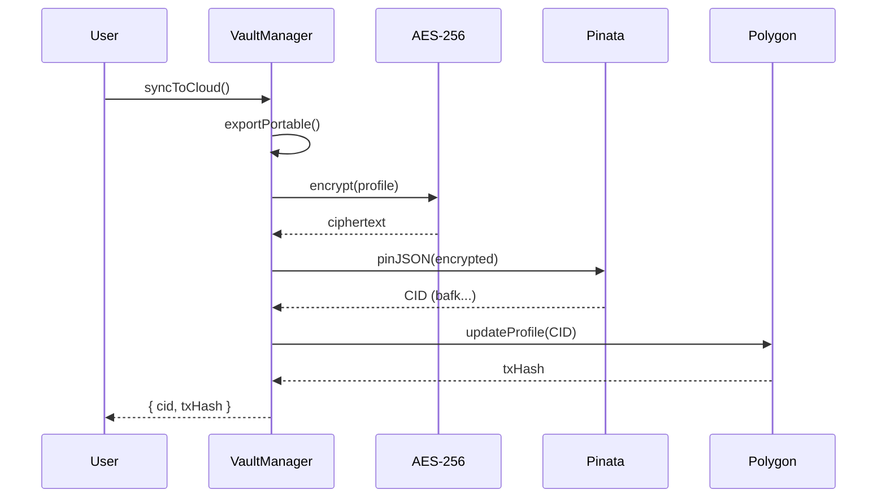
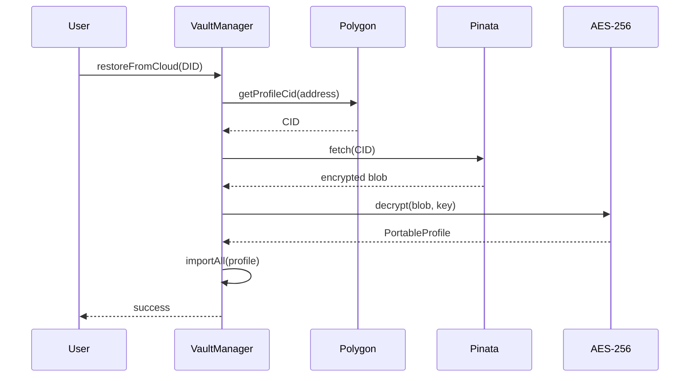
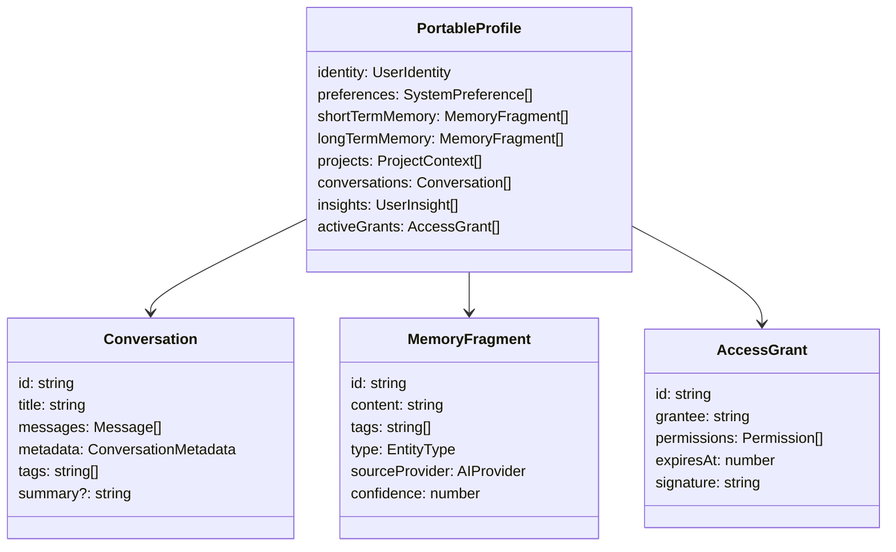
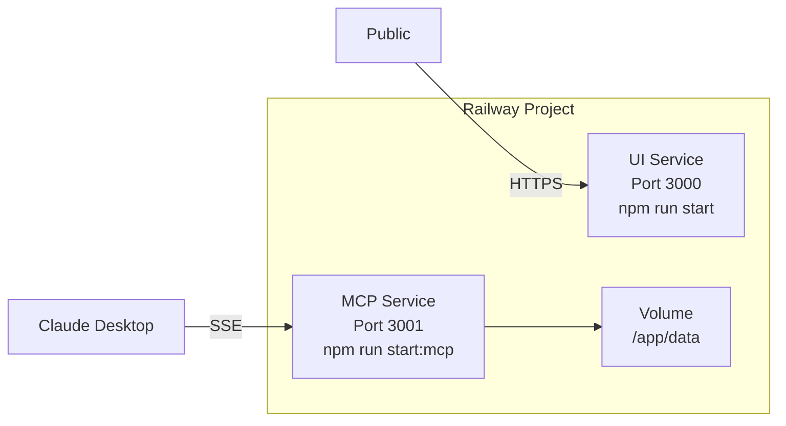

# Identity Report — Architecture

> **Version**: 2.0  
> **Last Updated**: December 30, 2025  
> **Status**: Production-Ready (Local-First with Decentralized Backup)

---

## Executive Summary

Identity Report is a **local-first, privacy-preserving identity management system** that enables users to own, control, and port their AI context across different providers. It combines cryptographic identity (DID), encrypted storage (AES-256-GCM), decentralized backup (IPFS), and blockchain-based discovery (Polygon) into a cohesive, portable profile system.

---

## Architecture Overview



---

## Module Deep Dive

### 1. Identity System (`src/lib/vault/identity.ts`)

The cryptographic foundation using **wallet-style identity management**.

| Component | Technology | Purpose |
|:----------|:-----------|:--------|
| **Mnemonic** | BIP39 (12 words) | Human-recoverable seed phrase |
| **Key Derivation** | SHA-256 → Ed25519 | Deterministic key generation |
| **DID Format** | `did:key:z<multicodec>` | W3C-compliant decentralized identifier |
| **Signing** | Ed25519 | Access grants & message verification |
| **Encryption Key** | PBKDF2 (mnemonic + password) | AES-256-GCM vault encryption |

**Security Model**: Two-factor protection

- **Factor 1**: Mnemonic phrase (something you have)
- **Factor 2**: Password (something you know)



---

### 2. Vault Manager (`src/lib/vault/manager.ts`)

The **central orchestrator** for all vault operations.

**Core Responsibilities**:

- Wallet creation & restoration from mnemonic
- Vault lock/unlock with encryption key derivation
- Conversation & memory import/export
- Cloud sync (IPFS + Registry)
- Access grant creation with cryptographic signatures

**Key Methods**:

| Method | Description |
|:-------|:------------|
| `createNewWallet()` | Generates mnemonic, derives keys, creates DID |
| `unlock(mnemonic, password)` | Derives encryption key, decrypts vault |
| `lock()` | Encrypts profile, saves to IndexedDB |
| `syncToCloud(config)` | Export → IPFS → Registry update |
| `restoreFromCloud(did)` | Registry → IPFS → Import → Decrypt |
| `grantAccess(grantee, permissions, duration)` | Creates signed AccessGrant tokens |

**State Machine**:



---

### 3. Storage Layer (`src/lib/storage/`)

#### IndexedDB Backend (`indexeddb.ts`)

Local-first storage using browser's IndexedDB.

**Object Stores**:

| Store | Key | Contents |
|:------|:----|:---------|
| `identity` | `'current'` | WalletIdentity (DID, publicKey) |
| `vault` | `'encrypted'` | EncryptedProfile blob |
| `conversations` | `id` | Individual Conversation objects |
| `memories` | `id` | MemoryFragment objects |
| `insights` | `id` | UserInsight objects |
| `session` | `'profile'` | Decrypted PortableProfile (session cache) |
| `blobs` | `id` | Binary attachments (images, audio) |

**Key Features**:

- Full export/import for backup (`.pvault` files)
- Blob storage for media attachments
- Session caching for unlocked profiles

---

### 4. MCP Server (`src/lib/mcp/server.ts`)

Implements the **Model Context Protocol** to expose user context to AI models.

#### Transport Modes

| Mode | Class | Use Case |
|:-----|:------|:---------|
| **STDIO** | `StdioTransport` | Local Claude Desktop integration |
| **SSE** | `SseTransport` | Cloud-hosted server (Railway) |

#### Resources Exposed

| URI | Description |
|:----|:------------|
| `profile://identity` | User identity (name, email, role) |
| `profile://preferences` | System preferences |
| `profile://memories` | All memory fragments |
| `profile://projects` | Project contexts with tech stacks |
| `profile://stats` | Vault statistics |
| `profile://conversations` | Full conversation list |
| `profile://conversation/{id}` | Individual conversation |

#### Tools Available

| Tool | Description |
|:-----|:------------|
| `search_memory` | Semantic search through memories |
| `add_memory` | Store new memory fragment |
| `get_conversation_history` | Retrieve conversations by topic/provider |
| `get_context_for_task` | AI-curated context for specific tasks |
| `archive_conversation` | Save current chat to vault |
| `grant_access` | Generate signed permission token |
| `sync_vault` | Push vault to IPFS |
| `toggle_auto_archive` | Enable/disable auto-save |
| `toggle_auto_sync` | Enable/disable auto-sync after archive |

---

### 5. Registry Services (`src/lib/services/registry.ts`)

Two implementations of the `RegistryProvider` interface:

#### MockRegistryService

- localStorage persistence
- 1-second simulated latency
- Development/testing mode

#### PolygonRegistryService

- Real blockchain interaction via `viem`
- Polygon Amoy testnet (configurable RPC)
- Smart contract: `ProfileRegistry.sol`

**Contract Interface** (`contracts/ProfileRegistry.sol`):

```solidity
mapping(address => string) public profiles;

function updateProfile(string calldata cid) external;
function getProfile(address user) external view returns (string memory);
event ProfileUpdated(address indexed user, string cid);
```

---

### 6. Importers (`src/lib/importers/`)

Multi-provider conversation import system with streaming support.

| Importer | File | Features |
|:---------|:-----|:---------|
| **OpenAI** | `openai.ts` | Full export parsing, streaming for large files, voice sessions, DALL-E generations |
| **OpenAI Folder** | `openai-folder.ts` | Directory-based imports with attachments |
| **Claude** | `claude.ts` | Anthropic export format |
| **Gemini** | `gemini.ts` | Google AI export format |
| **Base** | `base.ts` | Abstract class with streaming foundation |

**Streaming Architecture** (for 500MB+ files):



---

## Data Flow Diagrams

### Import Flow



### Sync to Cloud Flow



### Restore from Cloud Flow



---

## Type System (`src/lib/types.ts`)

### Core Types Hierarchy



---

## Deployment Architecture

### Railway Multi-Service



### Environment Variables

| Variable | Service | Purpose |
|:---------|:--------|:--------|
| `PINATA_JWT` | Both | IPFS upload authentication |
| `MCP_TRANSPORT` | MCP | `stdio` or `sse` |
| `VAULT_PATH` | MCP | Persistent storage location |
| `NEXT_PUBLIC_RPC_URL` | UI | Polygon RPC endpoint |
| `NEXT_PUBLIC_REGISTRY_ADDRESS` | UI | Deployed contract address |
| `PRIVATE_KEY` | MCP | Server-side registry writes |

---

## Security Considerations

### Implemented ✅

- AES-256-GCM encryption at rest
- Ed25519 signature verification
- Two-factor key derivation (mnemonic + password)
- Targeted SSE routing (no broadcast leaks)
- Local-first storage (data never leaves device by default)

### Future Enhancements 🔮

| Enhancement | Description | Priority |
|:------------|:------------|:---------|
| **Asymmetric Encryption** | Allow third parties to encrypt-to-user without seeing existing data | High |
| **Sync Conflict Resolution** | CRDT or last-write-wins for offline edits | Medium |
| **Tool Registry Discovery** | Schema-driven MCP tool enumeration | Low |
| **Mainnet Migration** | Chain abstraction for Polygon mainnet | Medium |

---

## File Structure Reference

```
src/
├── lib/
│   ├── types.ts              # Core type definitions
│   ├── currentProfile.ts     # Demo profile loader
│   ├── vault/
│   │   ├── manager.ts        # VaultManager (orchestrator)
│   │   ├── identity.ts       # BIP39/Ed25519 identity
│   │   └── crypto.ts         # AES-256-GCM encryption
│   ├── storage/
│   │   ├── interface.ts      # Storage provider interface
│   │   └── indexeddb.ts      # IndexedDB implementation
│   ├── services/
│   │   ├── ipfs.ts           # Pinata IPFS service
│   │   ├── registry.ts       # Mock + Polygon registry
│   │   └── summarizer.ts     # Conversation clustering
│   ├── mcp/
│   │   └── server.ts         # MCP server (STDIO + SSE)
│   └── importers/
│       ├── base.ts           # BaseImporter abstract class
│       ├── openai.ts         # OpenAI importer (streaming)
│       ├── openai-folder.ts  # OpenAI folder import
│       ├── claude.ts         # Claude importer
│       ├── gemini.ts         # Gemini importer
│       └── index.ts          # Importer factory
├── components/
│   ├── Sidebar.tsx           # Navigation
│   └── dashboard/            # Dashboard components
├── app/                      # Next.js App Router pages
└── types/                    # Additional type definitions

contracts/
└── ProfileRegistry.sol       # Solidity smart contract
```

---

## Changelog from Previous Architecture

| Item | Previous State | Current State |
|:-----|:---------------|:--------------|
| Registry | `MockRegistryService` (localStorage) | `PolygonRegistryService` + contract deployed |
| Access Grants | Defined in types, unused | Implemented with `signAccessGrant()` |
| MCP Tools | Basic 4 tools | 9 tools including archive, sync, grant |
| Import Size | Memory-limited | Streaming for 500MB+ files |
| SSE Transport | Broadcast to all clients | Targeted routing per session |

---

*This document supersedes the previous `architecture_review.md` and reflects the current production state of Identity Report.*
