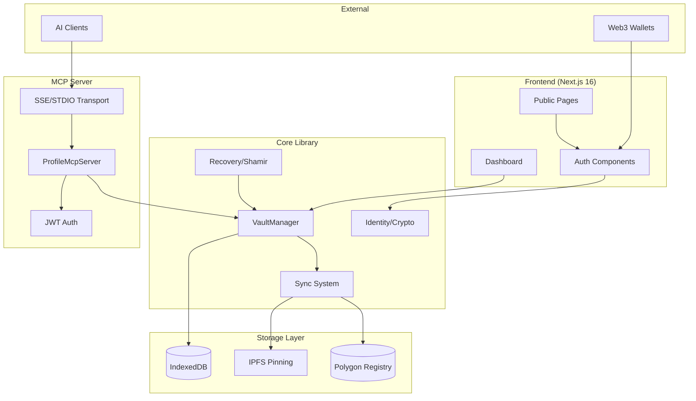
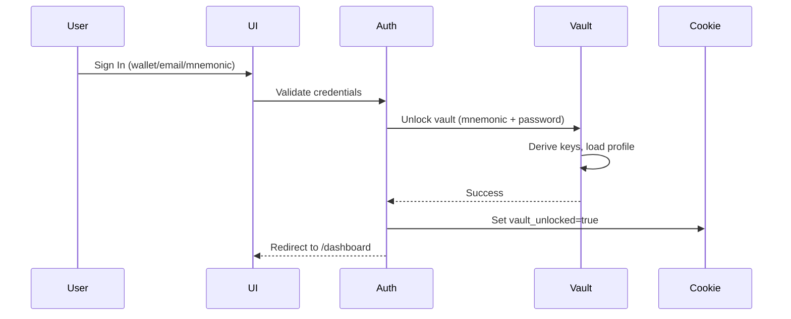
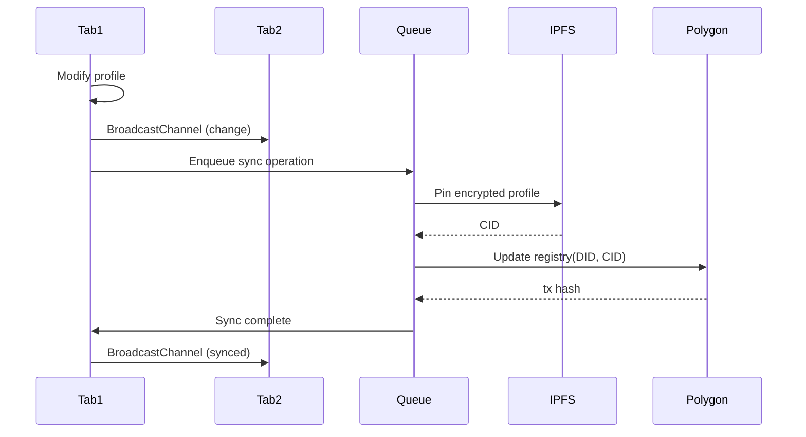
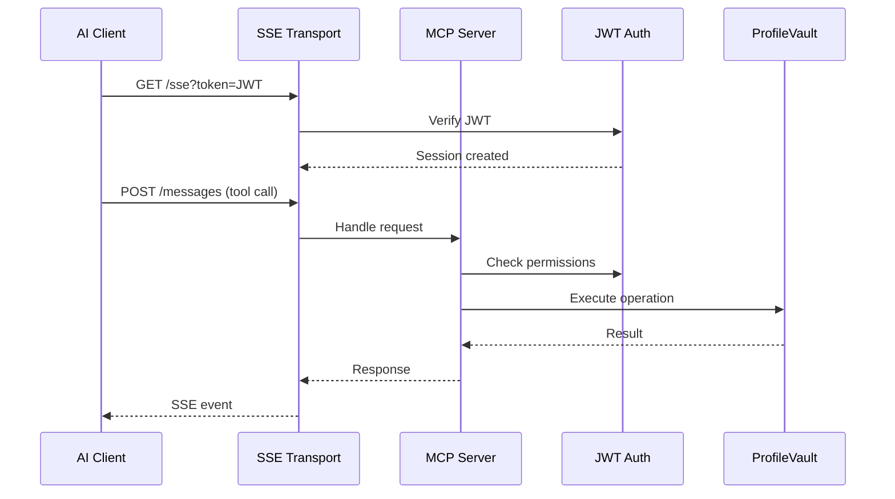

# Codebase Map

> Auto-generated by Cartographer. Last mapped: 2026-01-15

## System Overview

Privacy-preserving identity management system enabling users to own, control, and port their AI context across providers. Combines cryptographic identity (DID), encrypted storage (AES-256-GCM), decentralized backup (IPFS), and blockchain-based discovery (Polygon Amoy).



## Directory Structure

```
IdentityReport/
├── contracts/                    # Solidity smart contracts (UUPS upgradeable)
│   ├── ProfileRegistry.sol       # V1 simple registry (deprecated)
│   └── ProfileRegistryV2.sol     # V2 with guardian recovery + progressive decentralization
├── scripts/                      # Deployment and utility scripts
│   ├── deploy-upgradeable.ts     # UUPS proxy deployment
│   ├── upgrade-registry.ts       # Contract upgrade script
│   └── verify_crypto.ts          # Crypto smoke tests
├── src/
│   ├── app/                      # Next.js App Router
│   │   ├── (public)/             # Public route group (/, /signin, /signup)
│   │   ├── (dashboard)/          # Protected routes (/dashboard, /memory, etc.)
│   │   ├── api/                  # API routes (NextAuth, health)
│   │   └── onboarding/           # Vault creation wizard
│   ├── components/
│   │   ├── auth/                 # Auth components (Email, Wallet, OAuth, Mnemonic)
│   │   ├── dashboard/            # Dashboard UI (IdentityCard, SyncStatus, etc.)
│   │   ├── home/                 # Landing page sections (Hero, Features, CTA)
│   │   └── layout/               # Layout shells (PublicLayout, DashboardShell)
│   └── lib/
│       ├── auth/                 # Frontend auth (context, guards, session)
│       ├── importers/            # AI export parsers (OpenAI, Claude, Gemini)
│       ├── mcp/                  # MCP server implementation
│       │   └── transports/       # SSE and STDIO transports
│       ├── recovery/             # Shamir's Secret Sharing + guardian management
│       ├── services/             # External services (IPFS, Registry, Summarizer)
│       ├── storage/              # IndexedDB backend
│       ├── sync/                 # Multi-tab sync, merge, queue, pinning
│       └── vault/                # Core: identity, crypto, manager
├── tests/
│   ├── component/                # React component tests (vitest + jsdom)
│   ├── contracts/                # Hardhat contract tests
│   ├── e2e/                      # Playwright E2E tests
│   ├── integration/              # Middleware/API tests
│   ├── unit/                     # Unit tests (Node + jsdom)
│   ├── fixtures/                 # Test vectors and mock data
│   └── mocks/                    # Crypto, IndexedDB, IPFS mocks
└── .github/workflows/            # CI/CD (ci.yml, deploy.yml, release.yml)
```

## Module Guide

### src/lib/vault/ - Core Identity & Encryption

**Purpose**: BIP39 mnemonic-based identity, encryption, and central vault orchestration

| File | Purpose | Tokens |
|------|---------|--------|
| identity.ts | BIP39 mnemonic, Ed25519 keys, DID generation, JWT signing | 2847 |
| crypto.ts | AES-256-GCM encryption, PBKDF2 key derivation, blob handling | 1332 |
| manager.ts | Central orchestrator: encryption, sync, access grants, audit | 7289 |

**Key Exports**:
- `generateMnemonic()`, `createWalletIdentity()`, `deriveEncryptionKey()`
- `encryptData()`, `decryptData()`, `signMessage()`, `verifySignature()`
- `VaultManager` class (singleton `vault` instance)

**Critical Flow**:
```
Mnemonic (BIP39) → SHA-256 → Ed25519 Keys → did:key:z...
Mnemonic + Password → PBKDF2 (100k iterations) → AES-256-GCM Key
```

**Gotchas**:
- Mnemonic is root of trust - loss = permanent data loss
- Two-factor: mnemonic (have) + password (know)
- VaultManager must call `initializeTabSync()` before multi-tab features

---

### src/lib/sync/ - Multi-Tab Synchronization

**Purpose**: Three-way merge, tab coordination, offline queue, IPFS pinning

| File | Purpose | Tokens |
|------|---------|--------|
| merge.ts | Three-way smart merge with conflict detection | 5203 |
| tabs.ts | BroadcastChannel tab coordination, write authority | 2421 |
| queue.ts | Offline-first sync queue with retry/dead letter | 3384 |
| pinning.ts | Multi-service IPFS pinning (Pinata, Infura, Web3Storage) | 2884 |
| types.ts | Sync types (Conflict, Resolution, MergeResult) | 927 |

**Key Exports**:
- `smartMerge()`, `applyResolution()` - Merge operations
- `TabSyncManager` - Multi-tab coordination
- `SyncQueue` - Offline queue management
- `PinningManager` - IPFS redundancy (requires 2/3 services)

**Gotchas**:
- Only one tab has write authority (30s timeout on tab close)
- Queue blocks new writes if limit exceeded
- IPFS requires 2 of 3 pinning services to succeed

---

### src/lib/mcp/ - Model Context Protocol Server

**Purpose**: MCP server for AI clients with JWT auth and audit logging

| File | Purpose | Tokens |
|------|---------|--------|
| server.ts | Core MCP protocol handlers (resources, tools) | 3169 |
| auth.ts | JWT verification, scope-based permissions | 3596 |
| audit.ts | Audit logging with sensitive data scrubbing | 2316 |
| vault.ts | ProfileVault data store for MCP | 3796 |
| transports/sse.ts | HTTP SSE transport | 2004 |
| transports/stdio.ts | Standard I/O transport | 247 |

**Resources**: `profile://identity`, `profile://memories`, `profile://projects`, `profile://conversations`

**Tools**: `search_memory`, `add_memory`, `get_conversation_history`, `archive_conversation`, `grant_access`, `sync_vault`

**Permissions**: `read:identity`, `read:memories`, `write:memories`, `admin`

**Gotchas**:
- Session cleanup runs every 30 minutes
- Grant revocation checked per-request (doesn't disconnect immediately)
- Memory rotation at 50 short-term items

---

### src/lib/recovery/ - Social Recovery

**Purpose**: Shamir's Secret Sharing for mnemonic recovery via guardians

| File | Purpose | Tokens |
|------|---------|--------|
| shamir.ts | Secret splitting/reconstruction (GF(256)) | 2477 |
| guardian.ts | Guardian management, share distribution | 4456 |
| monitor.ts | Background expiry monitoring | 1858 |
| types.ts | Recovery types (Guardian, Share, Config) | 1407 |

**Key Exports**:
- `splitSecret()`, `combineShares()` - Shamir operations
- `GuardianManager` - Guardian CRUD, recovery flow
- `ShareExpiryMonitor` - Background expiry checks

**Recovery Flow**:
1. Split mnemonic into N shares (K threshold)
2. Distribute encrypted shares to guardians (IPFS)
3. Guardian initiates recovery on-chain
4. After K votes + timelock → reconstruct mnemonic

**Gotchas**:
- Shares NOT encrypted by Shamir (use GuardianShare wrapper)
- Any K shares reconstruct secret (K-1 reveals nothing)
- Default expiry check interval is 24h

---

### src/lib/importers/ - AI Export Parsers

**Purpose**: Parse conversation exports from OpenAI, Claude, Gemini

| File | Purpose | Tokens |
|------|---------|--------|
| openai.ts | ChatGPT export parser (complex multipart content) | 3978 |
| openai-folder.ts | Full export folder structure parser | 1740 |
| claude.ts | Anthropic Claude export parser | 1214 |
| gemini.ts | Google Gemini export parser | 1768 |
| base.ts | Abstract importer base class | 1193 |
| index.ts | Auto-detection and orchestration | 884 |

**Key Exports**:
- `detectProvider()` - Auto-detect AI provider from JSON structure
- `importConversations()` - Parse with appropriate importer
- Provider-specific importers: `openaiImporter`, `claudeImporter`, `geminiImporter`

**Gotchas**:
- OpenAI format most complex (attachments, DALL-E, voice, tool calls)
- Auto-detection tries JSON parse first, then heuristic field matching

---

### src/app/ - Next.js Routes

**Purpose**: App Router with public/protected route groups

| Route | Purpose | Tokens |
|-------|---------|--------|
| (public)/page.tsx | Landing page (Hero, Features, CTA) | 67 |
| (public)/signin/page.tsx | Sign-in (3 tabs: wallet/email/recovery) | 899 |
| (public)/signup/page.tsx | Sign-up (3 options: mnemonic/wallet/email) | 1195 |
| (dashboard)/dashboard/page.tsx | Main dashboard | 1591 |
| (dashboard)/import/page.tsx | AI data import with streaming | 5217 |
| (dashboard)/connect/page.tsx | MCP connection testing | 3367 |
| onboarding/page.tsx | Vault creation wizard | 3356 |
| middleware.ts | Route protection via vault_unlocked cookie | 278 |

**Route Groups**:
- `(public)` - PublicLayout wrapper, no auth required
- `(dashboard)` - DashboardShell wrapper, requires auth

**Gotchas**:
- OAuth redirects to `/onboarding?email=true` (must backup mnemonic)
- Middleware checks `vault_unlocked` cookie, redirects to `/signin`

---

### src/components/ - React Components

**Purpose**: UI components for auth, dashboard, and layout

| Category | Key Components | Total Tokens |
|----------|----------------|--------------|
| auth/ | EmailAuth, WalletAuth, MnemonicAuth, OAuthButtons | 3570 |
| dashboard/ | IdentityCard, SyncStatus, ConflictResolution, RecoverySetup | 23k |
| home/ | Hero, Features, CTASection | 1928 |
| layout/ | PublicLayout, DashboardShell, Sidebar | 1995 |

**Key Components**:
- `SyncStatus` - Real-time sync indicators via BroadcastChannel
- `ConflictResolution` - Three-way merge UI with editors
- `RecoverySetup` - 6-step guardian setup wizard
- `KnowledgeGraph` - 3D force-directed visualization (heavy)

**State Management**:
- AuthProvider context for auth state
- Local useState for UI state
- BroadcastChannel for cross-tab sync

---

### contracts/ - Smart Contracts

**Purpose**: UUPS upgradeable profile registry with guardian recovery

| File | Purpose | Tokens |
|------|---------|--------|
| ProfileRegistry.sol | V1 simple registry (deprecated) | 224 |
| ProfileRegistryV2.sol | V2 with recovery + progressive decentralization | 3048 |

**V2 Features**:
- UUPS proxy pattern (gas efficient)
- Guardian recovery: 3-5 guardians, threshold voting, 24h timelock
- Progressive decentralization: multisig required after 500 users

**Recovery On-Chain Flow**:
```
Guardian → initiateRecovery() → Other guardians vote
After threshold + timelock → completeRecovery(newCid)
User can cancelRecovery() anytime
```

---

## Data Flow

### Authentication Flow


### Sync Flow


### MCP Client Flow


## Conventions

### Naming
- **Files**: kebab-case for routes, PascalCase for components
- **Types**: PascalCase interfaces, SCREAMING_SNAKE for constants
- **Functions**: camelCase, verb-first (`createWallet`, `deriveKey`)

### Patterns
- **Singleton**: VaultManager, TabSyncManager, SyncQueue, PinningManager
- **Factory**: Transport creation, importer selection
- **Strategy**: Pinning services, importers
- **Facade**: VaultManager wraps all subsystems

### Styling
- Tailwind CSS 4 with custom glass effects
- CSS variables for theming (HSL-based)
- `glass-panel`, `glass-card`, `mesh-gradient` utility classes

## Gotchas

### Critical
1. **Mnemonic = root secret** - Loss is unrecoverable
2. **Single write authority** - Only one tab can write (30s timeout)
3. **IPFS redundancy** - Must succeed on 2/3 pinning services
4. **OAuth users must backup mnemonic** - Forced during onboarding

### Important
5. **Sync queue blocking** - Exceeds limit = blocks new operations
6. **Recovery threshold exact** - K-1 shares reveals nothing
7. **Contract tests disabled** - CI workflow has them commented out
8. **Type check continues on error** - Temporary CI workaround

### Non-Obvious
9. **Memory rotation** - Auto at 50 short-term items (oldest 20 → long-term)
10. **Session cleanup** - Every 30 minutes in MCP server
11. **Tab sync mock** - Synchronous in tests, async in production
12. **BroadcastChannel** - Not supported in all browsers

## Navigation Guide

**To add a new API endpoint**:
1. `src/app/api/<name>/route.ts` - Create route handler
2. Add to middleware matchers if auth needed

**To add a new dashboard page**:
1. `src/app/(dashboard)/<name>/page.tsx` - Create page
2. `src/components/Sidebar.tsx` - Add nav item
3. Middleware already protects `(dashboard)` group

**To add a new auth method**:
1. `src/components/auth/<Method>Auth.tsx` - Create component
2. `src/app/(public)/signin/page.tsx` - Add tab
3. `src/lib/auth/context.tsx` - Update AuthState type

**To add a new importer**:
1. `src/lib/importers/<provider>.ts` - Extend BaseImporter
2. `src/lib/importers/index.ts` - Add to detection logic
3. `src/app/(dashboard)/import/page.tsx` - Add provider option

**To modify sync behavior**:
1. `src/lib/sync/merge.ts` - Merge algorithm
2. `src/lib/sync/queue.ts` - Queue/retry logic
3. `src/lib/sync/tabs.ts` - Tab coordination

**To upgrade smart contract**:
1. `contracts/ProfileRegistryV3.sol` - New implementation
2. `scripts/upgrade-registry.ts` - Update contract name
3. If >500 users, requires multisig proposal

## Tech Stack

| Layer | Technology |
|-------|------------|
| Framework | Next.js 16 (App Router), React 19 |
| Styling | Tailwind CSS 4 |
| Web3 | viem 2.41, Polygon Amoy |
| Crypto | @noble/ed25519, @noble/hashes, bip39 |
| Auth | next-auth@5 (beta) |
| Storage | IndexedDB (fake-indexeddb for tests) |
| Testing | Vitest, Playwright, Hardhat |
| CI/CD | GitHub Actions, Docker, Railway |

---

If cartographer helped you, consider starring: https://github.com/kingbootoshi/cartographer - please!
