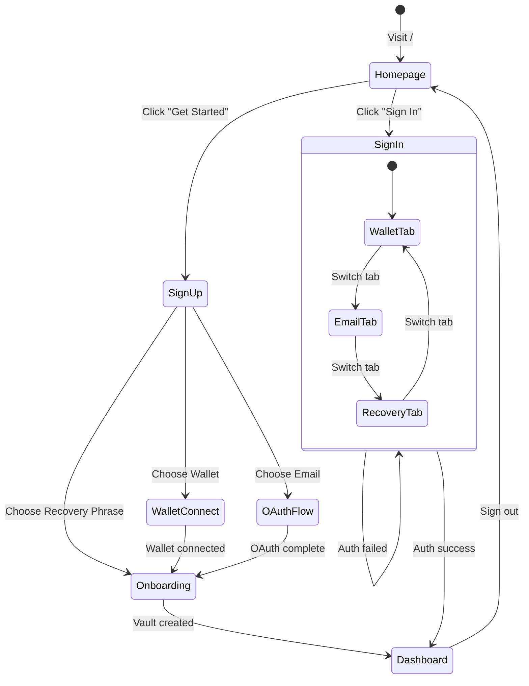

# Homepage & Authentication Spec

> Handoff document for implementing public homepage, sign in, and sign up flows.

---

## Overview

Add public-facing pages to IdentityReport:

- **Homepage** (`/`) - Marketing landing page
- **Sign In** (`/signin`) - Authentication for existing users
- **Sign Up** (`/signup`) - New user registration (redirects to onboarding)

Authenticated users see existing dashboard. Unauthenticated users on protected routes redirect to homepage.

---

## Phase 1: Homepage

### Route: `/` (public)

**Layout:** Full-width, no sidebar (new `PublicLayout` component)

**Sections:**

#### 1.1 Hero Section

```
┌─────────────────────────────────────────────────────────────┐
│  [Logo] Identity Report                    [Sign In] [Get Started] │
├─────────────────────────────────────────────────────────────┤
│                                                             │
│              Own Your AI Context                            │
│                                                             │
│    Your conversations, memories, and insights—encrypted,    │
│    portable, and under your control.                        │
│                                                             │
│         [Get Started]  [Learn More ↓]                       │
│                                                             │
│            ┌─────────────────────┐                          │
│            │   Hero Illustration │                          │
│            │   (3D graph preview │                          │
│            │    or glassmorphic  │                          │
│            │    vault visual)    │                          │
│            └─────────────────────┘                          │
└─────────────────────────────────────────────────────────────┘
```

- `mesh-gradient` background (Violet/Fuchsia palette to match dashboard)
- Glass navigation bar (`bg-white/40 backdrop-blur-xl`)
- Primary CTAs (`bg-gradient-to-r from-violet-600 to-fuchsia-600`)

#### 1.2 Features Section (AI Integration Focus)

Three feature cards using `glass-card` styling:

| Icon | Title | Description |
|------|-------|-------------|
| 🔌 | **Works with Any AI** | Connect to Claude, ChatGPT, Gemini via MCP protocol. Your context follows you. |
| 🧠 | **Persistent Memory** | AI remembers your preferences, projects, and history across sessions. |
| 📤 | **Import Everything** | Bring existing conversations from OpenAI, Anthropic, Google—streaming support for large exports. |

#### 1.3 CTA Section

```
┌─────────────────────────────────────────────────────────────┐
│                                                             │
│           Ready to own your AI identity?                    │
│                                                             │
│                    [Create Your Vault]                      │
│                                                             │
│         Already have an account? [Sign In]                  │
│                                                             │
└─────────────────────────────────────────────────────────────┘
```

### Components to Create

```
src/
├── components/
│   └── layout/
│       └── PublicLayout.tsx      # No sidebar, public nav
├── app/
│   └── (public)/                 # Route group for public pages
│       ├── layout.tsx            # Uses PublicLayout
│       └── page.tsx              # Homepage (move current / here)
```

---

## Phase 2: Authentication Pages

### 2.1 Sign In Page (`/signin`)

**Route:** `/signin` (public)

**Auth Methods (Tabs):**

```
┌─────────────────────────────────────────────────────────────┐
│                     Welcome Back                             │
│                                                             │
│   ┌──────────────┬──────────────┬──────────────┐           │
│   │   Wallet     │    Email     │   Recovery   │           │
│   └──────────────┴──────────────┴──────────────┘           │
│                                                             │
│   [Tab: Wallet]                                             │
│   ┌─────────────────────────────────────────┐              │
│   │  🦊 Connect MetaMask                     │              │
│   ├─────────────────────────────────────────┤              │
│   │  💼 Connect Coinbase Wallet              │              │
│   └─────────────────────────────────────────┘              │
│                                                             │
│   [Tab: Email]                                              │
│   ┌─────────────────────────────────────────┐              │
│   │  Email: [____________________]          │              │
│   │  Password: [____________________]       │              │
│   │                    [Sign In]            │              │
│   ├─────────────────────────────────────────┤              │
│   │  ── or continue with ──                 │              │
│   │  [Google]  [GitHub]                     │              │
│   └─────────────────────────────────────────┘              │
│                                                             │
│   [Tab: Recovery]                                           │
│   ┌─────────────────────────────────────────┐              │
│   │  Enter your 12-word recovery phrase:    │              │
│   │  [________________________________]     │              │
│   │  [________________________________]     │              │
│   │  Password: [____________________]       │              │
│   │                    [Unlock Vault]       │              │
│   └─────────────────────────────────────────┘              │
│                                                             │
│         Don't have an account? [Sign Up]                    │
└─────────────────────────────────────────────────────────────┘
```

**Behavior:**

- Wallet tab: Reuse existing `ConnectWallet.tsx` logic (EIP-6963)
- Email tab: New email/password form + OAuth buttons
- Recovery tab: Mnemonic input + password (existing restore flow from onboarding)

### 2.2 Sign Up Page (`/signup`)

**Route:** `/signup` (public)

**Options:**

```
┌─────────────────────────────────────────────────────────────┐
│                   Create Your Vault                         │
│                                                             │
│   Choose how to create your identity:                       │
│                                                             │
│   ┌─────────────────────────────────────────┐              │
│   │  🔐 Create with Recovery Phrase         │              │
│   │  Generate a secure 12-word phrase       │              │
│   │  (Recommended for full control)         │              │
│   │                         [Continue →]    │              │
│   └─────────────────────────────────────────┘              │
│                                                             │
│   ┌─────────────────────────────────────────┐              │
│   │  🦊 Create with Wallet                  │              │
│   │  Use MetaMask or Coinbase Wallet        │              │
│   │                         [Connect →]     │              │
│   └─────────────────────────────────────────┘              │
│                                                             │
│   ┌─────────────────────────────────────────┐              │
│   │  📧 Create with Email                   │              │
│   │  Quick setup with Google or GitHub      │              │
│   │                         [Continue →]    │              │
│   └─────────────────────────────────────────┘              │
│                                                             │
│         Already have an account? [Sign In]                  │
└─────────────────────────────────────────────────────────────┘
```

- Recovery Phrase → Redirect to `/onboarding` (existing flow)
- Wallet → Connect wallet → Generate mnemonic linked to wallet address → `/onboarding?wallet=true`
- Email (OAuth) → Google/GitHub flow → **Force Mnemonic Backup** → Set Vault Password → `/onboarding?email=true`

> [!IMPORTANT]
> OAuth users MUST backup their mnemonic and set a Vault Password to ensure they own their identity and their local data is encrypted.

---

## Phase 3: Route Protection

### 3.1 Auth Context

```typescript
// src/lib/auth/context.tsx
type AuthState = {
  isAuthenticated: boolean;
  authMethod: 'wallet' | 'email' | 'mnemonic' | null;
  user: {
    did: string;
    email?: string;
    walletAddress?: string;
  } | null;
};

// Session stored in an HTTP-only Cookie for Middleware compatibility
// Token: 'vault_unlocked=true'
// Sensitive keys remain in-memory and are NOT stored in the cookie.
```

### 3.2 Protected Routes

**Protected (require auth):**

- `/memory`
- `/profile`
- `/import`
- `/chat`
- `/connect`
- Dashboard home (current `/` content moves to `/dashboard`)

**Public:**

- `/` (homepage)
- `/signin`
- `/signup`
- `/onboarding`

### 3.3 Middleware

```typescript
// src/middleware.ts
const protectedPaths = ['/dashboard', '/memory', '/profile', '/import', '/chat', '/connect'];

export function middleware(request: NextRequest) {
  const isProtected = protectedPaths.some(p => request.nextUrl.pathname.startsWith(p));
  const hasSession = request.cookies.get('vault_unlocked');

  if (isProtected && !hasSession) {
    return NextResponse.redirect(new URL('/signin', request.url));
  }
}
```

---

## Phase 4: OAuth Integration

### 4.1 NextAuth.js Setup

```bash
npm install next-auth
```

**Providers:**

- Google OAuth 2.0
- GitHub OAuth

**Config:**

```typescript
// src/app/api/auth/[...nextauth]/route.ts
import NextAuth from 'next-auth';
import Google from 'next-auth/providers/google';
import GitHub from 'next-auth/providers/github';

export const { handlers, auth, signIn, signOut } = NextAuth({
  providers: [Google, GitHub],
  callbacks: {
    async signIn({ user, account }) {
      // After OAuth, if first time, flag user for Mnemonic Setup
      return true;
    }
  }
});
```

### 4.3 Sign Out Logic

- Clear `vault_unlocked` cookie.
- Call `vault.lock()` (wipes memory keys).
- Redirect to `/`.

```

### 4.2 Environment Variables (New)

```env
# OAuth
GOOGLE_CLIENT_ID=
GOOGLE_CLIENT_SECRET=
GITHUB_CLIENT_ID=
GITHUB_CLIENT_SECRET=
NEXTAUTH_SECRET=
NEXTAUTH_URL=http://localhost:3000
```

---

## State Machine



---

## File Structure (Final)

```
src/
├── app/
│   ├── (public)/               # Public route group
│   │   ├── layout.tsx          # PublicLayout wrapper
│   │   ├── page.tsx            # Homepage
│   │   ├── signin/
│   │   │   └── page.tsx        # Sign in page
│   │   └── signup/
│   │       └── page.tsx        # Sign up page
│   ├── (dashboard)/            # Protected route group
│   │   ├── layout.tsx          # DashboardShell + auth check
│   │   ├── page.tsx            # Dashboard home (current / content)
│   │   ├── memory/
│   │   ├── profile/
│   │   ├── import/
│   │   ├── chat/
│   │   └── connect/
│   ├── api/
│   │   └── auth/
│   │       └── [...nextauth]/
│   │           └── route.ts    # NextAuth handlers
│   └── onboarding/             # Stays at root (semi-public)
├── components/
│   ├── layout/
│   │   ├── DashboardShell.tsx  # Existing
│   │   └── PublicLayout.tsx    # New: public page layout
│   ├── auth/
│   │   ├── SignInForm.tsx      # Email/password form
│   │   ├── OAuthButtons.tsx    # Google/GitHub buttons
│   │   ├── WalletAuth.tsx      # Wallet connect for auth
│   │   └── MnemonicAuth.tsx    # Recovery phrase input
│   └── home/
│       ├── Hero.tsx            # Hero section
│       ├── Features.tsx        # Feature cards
│       └── CTASection.tsx      # Bottom CTA
├── lib/
│   └── auth/
│       ├── context.tsx         # Auth state context
│       ├── session.ts          # Session management
│       └── guards.tsx          # Route protection hooks
└── middleware.ts               # Next.js middleware for redirects
```

---

## Design Tokens (Reference)

From existing `globals.css`:

| Token | Value | Usage |
|-------|-------|-------|
| `--primary` | `hsl(270, 90%, 65%)` | Violet accent |
| `--secondary` | `hsl(310, 90%, 65%)` | Fuchsia accent |
| `--background` | `hsl(240, 10%, 4%)` | Dark mode base |
| `glass-panel` | blur(12px) + white/10 | Cards, nav (Dark style) |
| `glass-card` | blur(8px) + white/40 | Feature cards |
| `mesh-gradient` | Radial gradients | Hero backgrounds |

---

## Dependencies to Add

```bash
npm install next-auth@5
```

---

## Implementation Order

1. **Phase 1:** Homepage + PublicLayout (can ship standalone)
2. **Phase 2:** Sign in/up pages with mnemonic + wallet auth
3. **Phase 3:** Route protection + middleware
4. **Phase 4:** OAuth integration (Google + GitHub)

Each phase is independently deployable.

---

## Open Questions

- [ ] Should OAuth users also see/backup their generated mnemonic?
- [ ] Email verification required before vault access?
- [ ] Rate limiting on auth endpoints?
