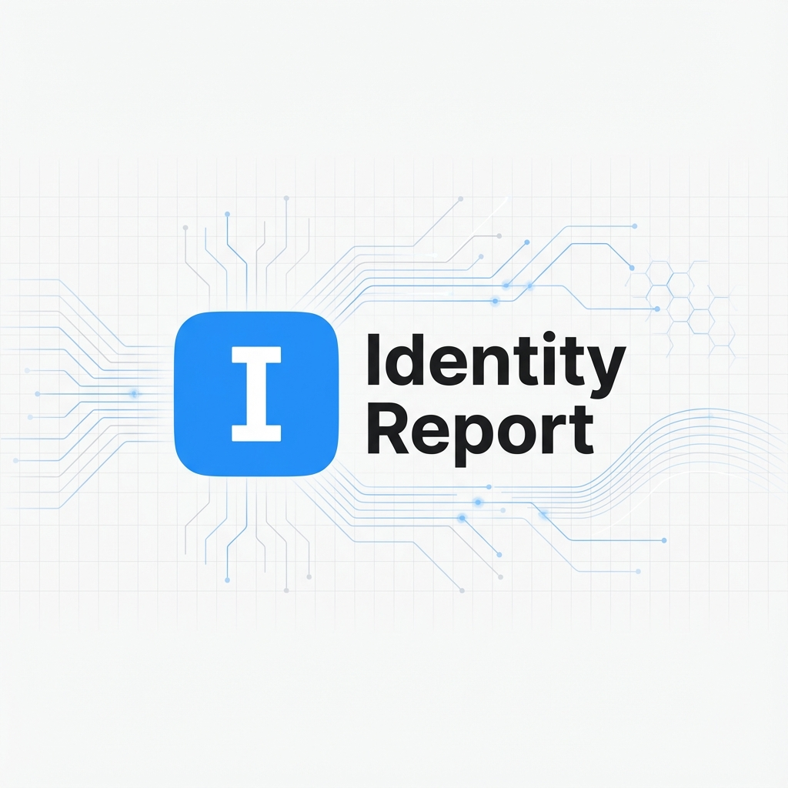
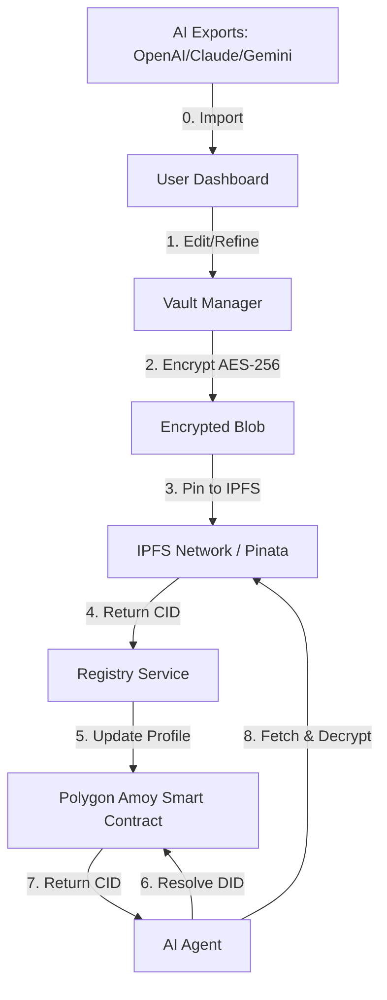

[](https://opensource.org/licenses/MIT) [](https://www.typescriptlang.org/) [](https://nextjs.org/) [](https://tailwindcss.com/)

# Identity Report

**The Central Intelligence for Your AI Context**

Identity Report is a secure, local-first dashboard for managing your digital identity (DID), cryptographic keys, and AI context. It acts as the definitive record—your "report"—that you choose to share with different AI providers, ensuring continuity, privacy, and granular access control.

## ❌ Without Identity Report

LLMs rely on fragmented, session-based memory. You get:

- ❌ **Amnesia**: Every new chat starts from scratch.
- ❌ **Privacy Leaks**: You paste sensitive data into random chat windows.
- ❌ **Vendor Lock-in**: Your "memory" is trapped inside OpenAI or Claude.

## ✅ With Identity Report

Identity Report provides a portable, encrypted vault for your context that *you* control.

- 1️⃣ **Own Your Identity**: Generate a cryptographic DID (`did:key`) that persists across platforms.
- 2️⃣ **Grant Access**: Authorize specific agents to read/write specific memories.
- 3️⃣ **Portability**: Bring your history with you, whether you're using Gemini, Claude, or a local Llama model.

## 🌟 Features

- **📄 The Identity Record**: A portable, cryptographic format for your identity and memories.
- **🔑 Access Control**: Granular permissions system (e.g., "Grant read access to Gemini 1.5 Pro for 1 hour").
- **👛 Multi-Wallet Support**: Integrated with EIP-6963 to support MetaMask, Coinbase Wallet, Phantom, and more.
- **⚡ Local-First**: Your data is encrypted using AES-256-GCM and stored locally by default.
- **🧠 Memory Graph**: Visualize your personal knowledge graph entities and relationships.
- **🔄 Context Convergence**: Import history from OpenAI, Claude, and Gemini, and sync the unified intelligence back to your vault.

## 🛠️ Installation

### Prerequisites

- Node.js 18+
- npm or yarn
- A Web3 Wallet (MetaMask, Coinbase Wallet, etc.)

### Getting Started

1. Clone the repository:

    ```bash
    git clone https://github.com/shihwesley/identity-report.git
    cd identity-report
    ```

2. Install dependencies:

    ```bash
    npm install
    ```

3. Run the development server:

    ```bash
    npm run dev
    ```

4. Open [http://localhost:3000](http://localhost:3000) in your browser.

## 📚 Architecture

Identity Report is built on a hybrid architecture that combines local-first privacy with decentralized persistence.

### Data Flow



### Components

- **Frontend**: Next.js 14 (App Router), Tailwind CSS.
- **Vault Manager**: Handles local encryption (AES-256-GCM) and key management (Ed25519).
- **Decentralized Storage**: Uses **IPFS** (via Pinata) to store encrypted profile blobs, ensuring data is available without a central server.
- **Identity Registry**: A smart contract on **Polygon Amoy** that maps user DIDs to their latest IPFS CID.
- **Protocol**: Implements the **Profile Context Protocol (PCP)** for cross-model interoperability.

## 🔄 Context Migration & Sync

Identity Report is designed to aggregate and unify your fragmented AI history.

1. **Import**: Upload `conversations.json` from OpenAI or exports from Claude/Gemini via the **Import** page.
2. **Refine**: The engine extracts key insights, project contexts, and memory fragments into your local vault.
3. **Sync**: Click **"Publish to Chain"** to encrypt your updated report and pin it to IPFS via the Registry contract.
4. **Converge**: After future sessions with any LLM, simply re-run the importer to "converge" new knowledge into your master Identity Record.

## 🛡️ Security

Your data is encrypted at rest. We use:

- **AES-256-GCM** for symmetric encryption of the vault.
- **Ed25519** for digital signatures and identity verification.
- **Local Storage (IndexedDB)** by default, ensuring data never leaves your device unless you explicitly publish it.

## 🚀 Deployment & CI/CD

Identity Report is designed for local-first privacy but can be deployed to the cloud for persistent, cross-device access.

- **Dockerized**: Multi-stage build for UI and MCP SSE.
- **CI/CD**: Automated via GitHub Actions (GHCR tagging).
- **Persistent Storage**: Uses `VAULT_PATH` environment variable for encrypted data sovereignty.

See [deployment.md](./deployment.md) for full instructions on cloud hosting and Docker setup.

## License

MIT
